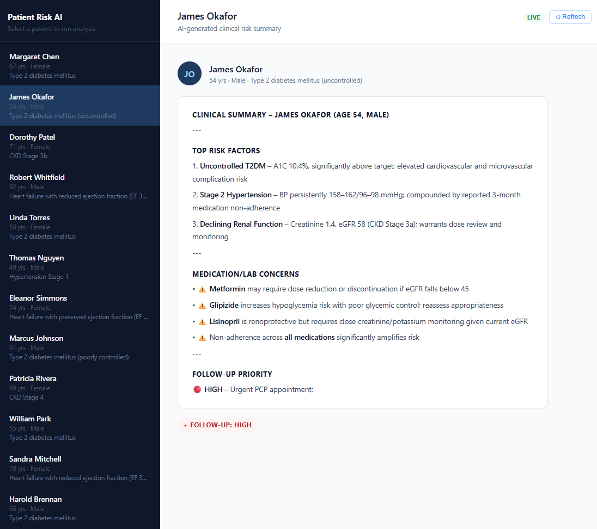

# Patient Risk AI

An AI-powered clinical risk prioritization tool that helps care coordinators identify which patients need attention and why — without manual chart review.

---

## The Problem

Care coordinators at value-based care organizations are responsible for hundreds of patients. The tools available to them were built for billing, not care management: they can pull a chart, but they can't tell you who to call first.

Manual chart review doesn't scale. A coordinator spending 5 minutes per patient on a 300-person panel has no time left to actually coordinate care. Worse, the review is inconsistent — what one person flags as urgent, another misses entirely.

The result: high-risk patients slip through until they land in the ED.

---

## What This Does

Patient Risk AI ingests structured patient data — diagnoses, medications, lab values, risk flags, and recent visit notes — and generates a concise clinical risk summary for each patient using Claude. Each summary identifies the top risk factors, flags medication or lab concerns, and assigns a follow-up priority (High / Medium / Low).

The workflow:

1. Care coordinator opens the app and sees a panel of patients
2. Clicking a patient triggers a live analysis via the Claude API
3. A risk summary appears in seconds — with priority badge and key concerns called out
4. Summaries are cached client-side so repeated views are instant; a Refresh button forces a new analysis when the clinical picture changes

---

## Demo



---

## Tech Stack

| Layer | Technology |
|---|---|
| LLM | Anthropic Claude (`claude-sonnet-4-6`) via Anthropic Python SDK |
| Backend | FastAPI + Uvicorn |
| Frontend | Vanilla HTML/CSS/JS (no build step) |
| Data | JSON flat file — structured to mirror real EHR output |
| Validation | Pydantic v2 |

The system prompt is cached with `cache_control: ephemeral`, so analyzing a full patient panel shares a cached prompt prefix — reducing latency and cost on repeated calls.

---

## How to Run

**1. Clone and configure**

```bash
git clone <repo-url>
cd patient-risk-ai
cp .env.example .env          # add your ANTHROPIC_API_KEY
```

**2. Install dependencies**

```bash
# install uv first (if not already installed)
curl -LsSf https://astral.sh/uv/install.sh | sh

# install dependencies
uv sync

# install with dev dependencies
uv sync --extra dev
```

**3. Start the backend**

```bash
uv run uvicorn backend.main:app --reload
```

**4. Open the frontend**

Open `frontend/index.html` directly in your browser. The page connects to `http://127.0.0.1:8000` by default.

**Verify setup (optional)**

```bash
uv run python test_setup.py    # confirms API key and data load
uv run python risk_engine.py   # runs analysis on all 12 sample patients
```

**Run tests**

```bash
uv run pytest
```

---

## Why This Matters

Value-based care success depends on proactive outreach — catching deterioration before it becomes an admission. This tool demonstrates how LLMs can slot into that workflow without requiring a full EHR integration or a data science team.

A few design choices worth noting:

- **Built on messy, real-world-shaped data.** The 12 sample patients reflect the kind of incomplete, multi-condition profiles that make manual review hard — not clean tutorial examples.
- **Prompt-cached for production patterns.** The system prompt uses Anthropic's `cache_control` API, a pattern that matters when you're analyzing a panel of patients in a single session.
- **Data layer is a seam, not a constraint.** Swapping `data/patients.json` for a live FHIR endpoint or a claims data extract requires no changes to the risk engine or the API.

Natural extensions: population-level risk scoring across a full panel, integration with claims data to surface utilization patterns, alert thresholds that push to care coordinator worklists.
